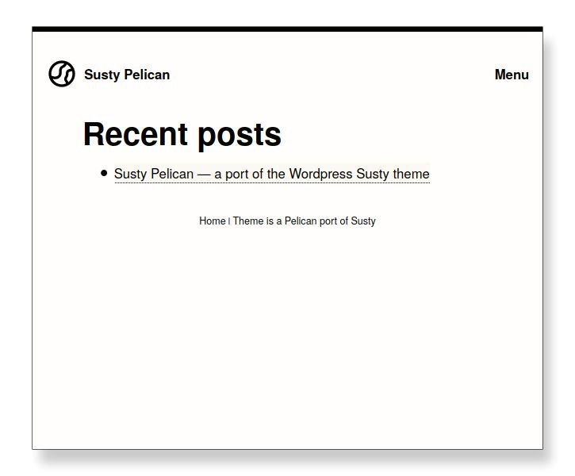

# Susty Theme for Pelican

A minimal theme for [Pelican][1] static site generator.
Based on the WordPress [Susty][2] theme.

[Live demo][3]

## Screenshots

### Main page

Contains the list of recent blog posts.

### Navigation menu

Page displayed on clicking the Menu label.

## A blog post

## Using this theme on your Pelican static site

1. Download [latest version][4].
2. Extract the zip archive to a **subdirectory**
   within your Pelican project.

   For example, under ``themes/susty-pelican``

        your-pelican-project
        │
        ├── content
        │   └── index.rst
        ├── Makefile
        ├── pelicanconf.py
        ├── publishconf.py
        ├── tasks.py
        ├── themes
            └── susty-pelican
                ├── README.rst
                ├── static
                └── templates

3. Update pelicanconf.py to use the new theme:

       THEME = 'themes/susty-pelican'

4. If you like to add pages to the site's navigation menu, add  to
   `pelicanconf.py`:

        TEMPLATE_PAGES = {'menu.html': 'menu/index.html'}

   Then add all your pages to the `MENUITEMS` variable in
   `pelicanconf.py`.

   For example:

        MENUITEMS = (
            ('Home', 'https://vimalkvn.github.io/susty-pelican'),
            ('GitLab', 'https://gitlab.com/vimalkvn/susty-pelican')
        )

## Credits

* [Susty][2] WordPress theme by Jack Lenox.
* [Eva Icons][5] project for the theme logo.
* Pelican builtin theme.

License
-------
GPL v3

---

[1]: https://github.com/getpelican/pelican
[2]: https://github.com/jacklenox/susty
[3]: https://vimalkvn.github.io/susty-pelican
[4]: https://gitlab.com/vimalkvn/susty-pelican
[5]: https://github.com/akveo/eva-icons
